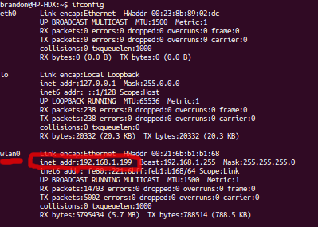
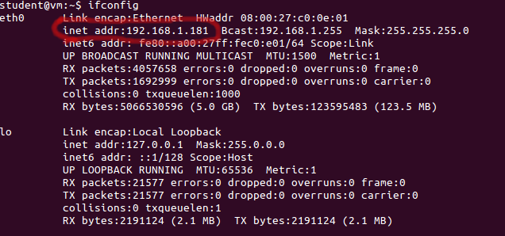

# Cops & Robbers Simulation

Project Name: brandon_and_ben 

Team Members:
- Ben Greatrix, bengreat@buffalo.edu
- Brandon Andreu, bandreu@buffalo.edu

---

## Project Description

This project was inspired from the children's game known as cops and robbers. There are two game modes. An introduction and description of each game mode can be acessed through the link below.

### Game Mode 1:


In this mode, only one person will be playing. You will be contolling a Turtlebot which is a "Robber". The Robber is always the Turtlebot with the red base and the cop is always the Turtlebot with the blue base. Your goal as the robber is to first steal a piece of gold and then exit the area, all while not being discovered by the autonomously controlled "Copbot".

Once you are close enough, a message will appear in the Robber.py terminal alerting you that you have the gold.


You must then drive into one of the two green exits.

Be careful not to be caught by the Copbot. If the Copbot gets too close to you (roughly a half meter) you will see the message below in your Robber.py terminal, signifying that you have lost the game.


---

### Game Mode 2:


In this mode, you will have the opportunity to play two players through a connected network or not. One player will be the Copbot, on the master computer, while the other player will connect to the Robber, on the client computer, over a linked network. Alternatively, if you dont have an extra laptop you are capable of playing this game mode with both players by just using the master computer and by following the explicit instructions below. The rules of the game are the same as Mode 1. However, the area is larger and more complex.

---

## Contributions

This project encorporates gamification into the ROS world. Our team is able to demonstrate an understanding of components of ROS such as networking, visualization, manual and autonomous control, finite state machines, and logic all while creating a fun, interactive program.

---

## Installation Instructions

List of Prerequisite Software:
- Gazebo

This project does not require you to generate any mazes but if you wish to develope your own area, you may do so by referencing the world_demo repo contained in the link below. 

https://github.com/IE-482-582/fall2018.git

This would also require you to change the world directory in the `*_Area.launch` files and also change the coordinates of the gold and exits in the `*Copbot.py` and `*Robber.py` scripts.

1. Create the Package:
    ```
    cd ~/catkin_ws/src
    catkin_create_pkg brandon_and_ben rospy geometry_msgs sensor_msgs nav_msgs std_msgs
    ```
2. Create our `scripts`, `robots`, `msg`, and `srv` directories:
    ```
    cd ~/catkin_ws/src/brandon_and_ben
    mkdir scripts robots msg srv
    cd ~/catkin_ws/src/brandon_and_ben/robots
    mkdir meshes urdf
    cd ~/catkin_ws/src/brandon_and_ben/robots/meshes
    mkdir images
    ```
3. Get the source code from the course github site:
    ```
    cd ~/Downloads
    rm -rf course-project-brandon_and_ben
    git clone https://github.com/IE-482-582/course-project-brandon_and_ben.git
    ```
4. Copy the Python scripts and robots to our project workspace
    ```
    cd course-project-brandon_and_ben/code/brandon_and_ben
    cp scripts/* ~/catkin_ws/src/brandon_and_ben/scripts
    cp msg/* ~/catkin_ws/brandon_and_ben/msg
    cp srv/* ~/catkin_ws/brandon_and_ben/srv
    cp robots/*.urdf.xacro ~/catkin_ws/src/brandon_and_ben/robots
    cp robots/urdf/*.urdf.xacro ~/catkin_ws/src/brandon_and_ben/robots/urdf
    cp robots/meshes/*.dae ~/catkin_ws/src/brandon_and_ben/robots/meshes
    cp robots/meshes/images/*.jpg ~/catkin_ws/src/brandon_and_ben/robots/meshes/images
    ```
    
5. Make everything executable
    ```
    cd ~/catkin_ws/src/brandon_and_ben/scripts
    chmod +x *
    ```
    
6. Compile/make our package
    ```
    cd ~/catkin_ws
    catkin_make
    ```

---

## Running the Code

### Game Mode 1

We'll need four (4) terminal tabs across two (2) terminal windows

1. Open up a terminal and launch the course.
    ```
    cd ~/catkin_ws/src/brandon_and_ben/scripts
    roslaunch brandon_and_ben Mode_1_Area.launch
    ```
    
2. As you will notice later, the camera feed from the Robber is quite glitchy. It is nice to have the third person view from gazebo for reference. Go full screen on gazebo and position the area so that it is in the lower right corner of your screen, as shown below.


3. In the same terminal, open up a new tab and launch the Robber controls.
    ```
    rosrun brandon_and_ben Robber_Controls.py
    ```
    
*Note: that the Copbot has been given a maximum linear speed of 1 m/s and maximum angular rotation of .3 rads/s. Adjust the speed of your Robber accordingly if you want to give the Copbot a fair shot... or don't... doesn't matter either way.*

    
4. In a new terminal, launch the Robber script.
    ```
    rosrun brandon_and_ben Mode_1_Robber.py
    ```
    
    You will see that a window appears, this is the camera feed from the Robber. If you feel confident, you can minimize gazebo and try to get away with the gold using only the view from the camera.
    
5. Take a moment to position your terminals appropriately. One good arangement is shown below


6. In the same terminal as your Robber Controls, open up a new tab and launch the Copbot. The Copbot waits for no one and will begin patrolling as soon as the script is launch. Be ready to navigate back to your Robber control window as soon as you launch the Copbot.
    ```
    rosrun brandon_and_ben Mode_1_Copbot.py
    ```
    
7. Navigate to your Robber control window and try and steal the gold. Good Luck!

---

### Game Mode 2

We'll need two (2-3) terminal windows for the Master computer and only 2 terminal windows for the client computer

For testing purposes, it is recommended that you start with the "standalone" version.  This will require you to run gazebo on your machine.  

## Standalone Version (not networked)
1. **Terminal 1** -- Open Gazebo and ready your world for a game of Cops and Robbers:
	```
	cd ~/catkin_ws/src/brandon_and_ben/scripts
	roslaunch brandon_and_ben Mode_2_Area.launch
	```
	
	- NOTE: When the ` Mode_2_Area.launch ` script is launched, a seperate terminal window will appear that will allow you to manually control the Copbot before you initialize any simulations
	
	- NOTE: If you somehow close the teleop controls for the Copbot, you may enter this command to regain control. However!! Make sure you dont have the Mode_2_Copbot.py script running.
	```
	rosrun brandon_and_ben Robber_Controls.py robot1/cmd_vel_mux/input/teleop:= robot2/cmd_vel_mux/input/teleop
	```
	
2. **Terminal 2** -- Start the CopBot simulation: 
	```
	cd ~/catkin_ws/src/brandon_and_ben/scripts
	rosrun brandon_and_ben Mode_2_Copbot.py
	```	

3. **Terminal 3** -- Launch your Robber Controller node:
	```
	cd ~/catkin_ws/src/turtlebotrace/scripts
	rosrun brandon_and_ben Robber_Controls.py	
	```

	- Note: You have complete freedom to fluctuate the linear and angular velocity of the bot but beware, because if you move to fast or crash into a wall one could easily end up tipping over or spinning out of control. 
	
---

## Networked Version 
### On the Master computer (server):

These instructions are intended to link one or multiple computers across a linked IP Address that will belong to a master computer/server.

1. **Terminal 1** --  Find and keep track of your IP address:
	```
	ifconfig
	```
When the 'ifconfig' command is given to the terminal, the following two pictures depict what you will witness from the perspective of a virtually machine derived from your computers installed Windows or Mac OS ,and a native installation of Ubuntu 14.04. 

Shown below, is what you should see if you have a native installation of Ubuntu 14.04. The red circle depicts the correct name and IP address you should use in order to establish the correct network connectivity.



Shown below, is what you should see if you have a virtual machine of Ubuntu 14.04. The red circle depicts the correct name and IP address you should use in order to establish the correct network connectivity.



- NOTE 1: Keep this terminal to the side with your IP Address because in order to establish a solid connection between the master and client computers we must link each computer to the MASTER IP Address
	
- Note 2: Only the master computer needs to acquire its IP Address, therefore each client needs to record this IP address in order to connect to the correct master computer. 
	 
### On the Master computer (server):
2. **Terminal 2** -- Set master and launch gazebo:
	```
	export ROS_MASTER_URI=http://(YOUR_IP_ADDRESS):11311
	cd ~/catkin_ws/src/brandon_and_ben/scripts
	roslaunch brandon_and_ben Mode_2_Area.launch
	```
	
	- Replace `(YOUR_IP_ADDRESS)` with the IP-Address of the computer that will run the tower to enable a linked network. 
	- NOTE: When the ` Mode_2_Area.launch ` script is launched, a seperate terminal window will appear that will allow you to manually control the Copbot before you initialize any simulations
	
	- NOTE: If you somehow close the teleop controls for the Copbot, you may enter this command to regain control. However!! Make sure you dont have the Mode_2_Copbot.py script running.
	```
	rosrun brandon_and_ben Robber_Controls.py robot1/cmd_vel_mux/input/teleop:= robot2/cmd_vel_mux/input/teleop
	```

3. **Terminal 3** -- Start the CopBot simulation: 
	```
	cd ~/catkin_ws/src/brandon_and_ben/scripts
	rosrun brandon_and_ben Mode_2_Copbot.py
	
	- NOTE: The Copbot simulation doesnt need to exported across the linked IP Address because the script is running off the master computer and doesnt need to be connected by any client computers.
	
4. **Terminal 4** -- Set master and run tower:
	```
	export ROS_MASTER_URI=http://(YOUR_IP_ADDRESS):11311
	cd ~/catkin_ws/src/brandon_and_ben/scripts
	rosrun brandon_and_ben tower.py brandon_and_ben
	```

	- NOTE 1: This script requires one input argument, which is the name of the race.  The input name is used to identify the type of world being used. The purpose of the tower.py script is to keep track and record of which client computers are logged on and registered as the robber. 
	
	- NOTE 2: The robots won't be able to move until you "release the game" by hitting `Enter` in this terminal window.


### On the Client Computer:
1. **Terminal 1** -- Set master and run Mode_2_Robber simualtion:
	```
	export ROS_MASTER_URI=http://(MASTER_IP_ADDRESS):11311
	cd ~/catkin_ws/src/brandon_and_ben/scripts
	rosrun brandon_and_ben Mode_2_Robber.py
	```

	- NOTE: The Master IP Address should be the IP Address of the computer you wish to connect to. 
	- NOTE: You shouldnt need to screen-peak at the master computer since the Mode_2_Robber.py script is able to send a raw camera feed across the linked network. It makes the game more fun!

2. **Terminal 2** -- Run the manual keyboard controller:
	```
	export ROS_MASTER_URI=http://(MASTER_IP_ADDRESS):11311
	cd ~/catkin_ws/src/brandon_and_ben/scripts
	rosrun brandon_and_ben Robber_Controls_Link.py
	```
	
	- Note: You have complete freedom to fluctuate the linear and angular velocity of the bot but beware, because if you move to fast or crash into a wall one could easily end up tipping over or spinning out of control. 

3. Tell the person running the Tower to "release the game" by hitting `Enter` in their Terminal 2.


---

## Measures of Success

<TABLE>
<TR>
	<TH>Measure of Success (from your PROPOSAL)</TH>
	<TH>Status (completion percentage)</TH>
</TR>
<TR>
	<TD>Complete proposal document</TD>
	<TD>100%</TD>

</TR>
<TR>
	<TD>Generate complex gazebo world</TD>
	<TD>100%</TD>

</TR>
<TR>
	<TD>Color Turlebot bases two different colors</TD>
	<TD>100%</TD>
	
</TR>
<TR>
	<TD>Spawn two Turlebots in gazebo</TD>
	<TD>100%</TD>
	
</TR>
<TR>
	<TD>Allow two Turtlebots to be controlled at the same time (Not over a network)</TD>
	<TD>100%</TD>
	
</TR>
<TR>
	<TD>Allow Copbot to know when the Robber is in its feild of view</TD>
	<TD>100%</TD>
	
</TR>
<TR>
	<TD>Generate simple gazebo world</TD>
	<TD>100%</TD>
	
</TR>
<TR>
	<TD>Network Turtlebots</TD>
	<TD>100% Able to tap into Robber camera feed</TD>
	
</TR>
<TR>
	<TD>Allow Copbot to autonomously wander the area in search of the Robber</TD>
	<TD>100%</TD>
	
</TR>
<TR>
	<TD>Allow Copbot to autonomously follow the Robber when he is in its field of view</TD>
	<TD>100%</TD>
	
</TR>
<TR>
	<TD>Allow Robber to know its coordinates within the area</TD>
	<TD>100%</TD>
	
</TR>
<TR>
	<TD>Write final launch files for the gazebo worlds</TD>
	<TD>100%</TD>
	
</TR>
<TR>
	<TD>Write final launch files for controlling the Turtlebots</TD>
	<TD>100%</TD>
	
</TR>
<TR>
	<TD>Write final script for the Robber</TD>
	<TD>100%</TD>
	
</TR>
<TR>
	<TD>Write final script for the Copbot</TD>
	<TD>100%</TD>
	
</TR>
<TR>
	<TD>Complete final report</TD>
	<TD>100% </TD>
	
</TR>
<TR>
	<TD>Submit final presentation</TD>
	<TD>100%</TD>

</TR>
</TABLE>

---

## What did you learn from this project?

We now have a solid understanding of editing urdf files for models, subscribing/publishing to topics, setting up networks, and writing logic for turtlebots. We learned techniques such as creating state machines, spinning code, and using callbacks.

---

## Future Work

*If a student from next year's class wants to build upon your project, what would you suggest they do?  What suggestions do you have to help get them started (e.g., are there particular Websites they should check out?).*

If a student wanted to imrove upon this project, some suggestions are as follows:
- Improve the speed at which the program runs
- improve upon the copbot.py script that the Copbot uses so that it is better at pursuing the Robber
- Make the program more user friendly (i.e. encorporate everything into one launch file)
- Build a map for the copbot so it can autonomsly pursue the robber in the complex area

---

## References/Resources

From The tetbook:
- Chapter 6
	- helped with understanding how to connect and use the camera on the Turtlebots
- Chapter 7
	- helped with getting started on the logicstatements for a wanderbot
- Chapter 8
	- helped with controlling a robot using the keypad
- Chapter 12
	- helped with understadning the masking used to develope a followbot
	
From Github:
- 03_wanderbot
	- used a variation of the wander.py scripts in the final project
- 05 Teleopbot
	- used the teleop_key.py script for the controls of robots in mode 2 and a variation of the keys_to_twist.py scripts in mode 1
- 06_Followbot
	- used a variation  of the move_robot.py scripts in mode 1
- 09_redball_code
	- helped with understanding how to vidualize the red base of the robber
- maze_generator
	- used to generate the courses for modes 1 and 2
- world_demo
	- helped understand how the courses were being generated
- optimatorlab/turtlebotrace
	- helped with understanding how to edit the urdf files for the turtlebots so the bases could be different colors

From ROS wiki:
- https://answers.ros.org/question/261782/how-to-use-getmodelstate-service-from-gazebo-in-python/
	- helped with figuring out how to get coordinates of Turtlebots in gazebo world
	
- http://wiki.ros.org/navigation/Tutorials/RobotSetup/Sensors
	- helped with understanding how to use information from LaserScan

From Youtube:
- https://www.youtube.com/watch?v=WqK2IY5_9OQ&feature=youtu.be
	- walked through code behind getting coordinates of multiple objects/models in gazebo

- https://www.youtube.com/watch?v=RFNNsDI2b6c
	- walked through how to read and use LaserScan data

---
